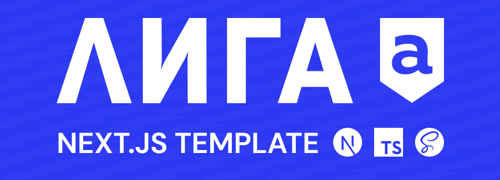

[](https://ligaa.agency/)

# Гайд по работе

Для начала работы необходимы:

- **[Node.js](https://nodejs.org/en/download/prebuilt-installer)** 22 версии (LTS) или новее
- Пакетный менеджер **[yarn](https://classic.yarnpkg.com/lang/en/docs/install/)** `npm install --global yarn`

## 🐱‍💻 Команды

| Command                  | Action                                        |
| :----------------------- | :-------------------------------------------- |
| `yarn install`           | Установить зависимости                        |
| `yarn run dev`           | Запустить локальный дев сервер                |
| `yarn run build`         | Создать оптимизированный production build     |
| `yarn run start`         | Запустить production build                    |
| `yarn run lint`          | Запустить линтер                              |
| `yarn run stylelint`     | Запустить линтер стилей                       |
| `yarn run typecheck`     | Проверить типы (`tsc --noEmit`)               |
| `yarn run prettier`      | Фрорматировать код с настройками prettier     |
| `yarn run check`         | Запустить проверку линтерами и форматирование |
| `yarn run gen:component` | Утилита для создания шаблонного компонента    |

## 🚀 Структура

Используется модульная архитектура

Нижележащий слой может испльзоваться только в слоях стоящих выше по иерархии

### `shared 🡒 ui 🡒 service 🡒 components 🡒 modules 🡒 views 🡒 app`

**Для генерации компонентов используйте утилиту `yarn run gen:component`**

```text
├── public/                 # статические файлы (иконки, картинки и тп.)
│   ├── icons/
│   ├── images/
│   ├── ...
│   ├── favicon.ico
│   └── robots.txt
├── src/
│   ├── app/                # next app router
│   │   ├── fonts/          # шрифты для локального подключения next/font
│   │   ├── ...
│   │   ├── layout.tsx
│   │   └── page.tsx
│   ├── components/         # компоненты ( могут обладать бизнес-логикой )
│   │   ├── dialog/
│   │   ├── ...
│   │   └── index.ts
│   ├── modules/            # модули ( могут иметь вложенные компоненты, своё состояние и изолированную логику )
│   │   ├── footer/
│   │   ├── header/
│   │   └── ...
│   ├── service/            # сервисные компоненты ( провайдеры, порталы и подобные им сущности )
│   │   ├── portal/
│   │   ├── provider/
│   │   └── ...
│   ├── shared/             # общее ( переиспользуемые глобальные сущности не имеющие конкретной привязки )
│   │   ├── api/
│   │   ├── assets/
│   │   ├── atoms/
│   │   ├── const/
│   │   ├── hooks/
│   │   ├── styles/
│   │   └── types/
│   ├── ui/                 # элементы интерфейса ( базовые переиспользуемые ui компоненты )
│   │   ├── button/
│   │   ├── ...
│   │   └── index.ts
│   └── views/              # страницы ( лэйауты страниц )
│       ├── home/
│       └── ...
├── util/                   # утилиты ( автоматизация процессов, генерация компонентов, оптимизация картинок и тп. )
│   ├── component/
│   └── ...
├── package.json
└── ...
```

## 🧭 Границы слоёв

Слои отличаются **назначением**, а не размером. Основные правила:

- **`ui/`** — безсостоятельные (stateless) визуальные примитивы без бизнес-логики. Принимают данные и колбэки через пропсы. Примеры: `Button`, `Input`, `Heading`, `Wrapper`. Знают только о себе.
- **`components/`** — переиспользуемые компоненты, которые могут включать локальную логику/хуки, но не привязаны к конкретной странице или домену. Примеры: `Dialog`, универсальные формы, слайдеры.
- **`modules/`** — крупные самодостаточные блоки с собственной логикой, состоянием и внутренними подкомпонентами. Используются сразу на нескольких страницах. Примеры: `Header`, `Footer`, блок авторизации.
- **`views/`** — композиция страницы. Собирает модули/компоненты под конкретный маршрут, рендерится из `app/*/page.tsx`.
- **`service/`** — провайдеры и системные утилиты уровня приложения (`Provider`, `Portal`).
- **`shared/`** — переиспользуемые сущности без привязки к UI (api, atoms, hooks, types, const, styles).

**Как выбрать между `components/` и `modules/`:**

- Нужен внутри одного блока и не имеет внутреннего состояния → `ui/`.
- Используется в разных местах, самодостаточен, но по-прежнему «кирпич» → `components/`.
- Это законченный блок интерфейса со своими подкомпонентами и состоянием (шапка, футер, форма логина) → `modules/`.

**Направление зависимостей строго однонаправленное:**

`shared → ui → service → components → modules → views → app`

Нижележащий слой **не импортирует** из вышележащих.

## 🔄 Стейт менеджмент

В качестве стейт менеджера по умолчанию используется **[Jotai](https://jotai.org/)**

Атомы хранятся в `src/shared/atoms/` и импортируются через алиас `@atoms/*`.

Шаблон атома (см. `src/shared/atoms/deviceAtom.ts`):

```typescript
import { atom } from 'jotai'

export type ThemeAtomType = 'light' | 'dark'

const themeAtom = atom<ThemeAtomType>('light')

// разделяем read и write атомы, чтобы компоненты подписывались только на нужное
export const themeReadAtom = atom((get) => get(themeAtom))
export const themeWriteAtom = atom(null, (_get, set, update: ThemeAtomType) => {
  set(themeAtom, update)
})
```

Использование:

```typescript
import { useAtomValue, useSetAtom } from 'jotai'
import { themeReadAtom, themeWriteAtom } from '@atoms/themeAtom'

const theme = useAtomValue(themeReadAtom)
const setTheme = useSetAtom(themeWriteAtom)
```

## 🧩 Создание нового модуля / компонента / view

Используйте генератор:

```bash
yarn run gen:component
```

Он спросит имя и попросит выбрать директорию (`ui`, `components`, `modules`, `views`) и создаст:

- `name.tsx` — сам компонент
- `name.types.ts` — типы пропсов
- `name.module.scss` — стили
- `index.ts` — публичный экспорт

Для `views/` и `modules/` `index.ts` не добавляется в общий бочечный экспорт автоматически — их подключают напрямую через путь (`@views/home`, `@modules/header`).

## 🗺 Добавление нового маршрута (страницы)

1. Сгенерировать view: `yarn run gen:component` → выбрать `src/views`. Например, получится `src/views/about/`.
2. Создать папку маршрута в App Router: `src/app/about/page.tsx`:

   ```typescript
   import type { Metadata } from 'next'
   import { AboutView } from '@views/about'

   export const metadata: Metadata = {
     title: 'About',
     description: 'About page'
   }

   export default function AboutPage() {
     return <AboutView />
   }
   ```

Страница в `app/` должна оставаться тонкой — вся разметка и композиция живут во `views/`.

## 🎴 Картинки

Для оптимизации изображений используйте компонент **[next/image](https://nextjs.org/docs/app/building-your-application/optimizing/images)**

## ♠️ Иконки

SVG графика для импорта в качестве компонента хранится в директории `src/shared/assets/icons`

Импортируется как компонент:

```typescript jsx
import Icon from '@icons/icon.svg'

const IconExample = () => (
  <div>
    <Icon />
  </div>
)
```

## 📏 Адаптив и скейлинг

По умолчанию в сборке используется скейлинг - хук `useScaling` (вызов из `src/service/provider`). В этом же хуке устанавливается значение для кастомной переменной `--vh` и происходит определение типа устройства, в зависимости от ширины вьюпорта (`mobile`, `tablet`, `desktop`).

В качестве параметров `useScaling` принимает `deviceBreakpoints` (брейкпоинты для определения типа устройства) и `scalingBreakpoints` (брейкпоинты для скейлинга).

Каждый брейкпоинт в `scalingBreakpoints` должен определять ширину экрана `size`, на которой будет произведён переход на него (с опциональным значением `min` для скейлинга вниз от брейкпоинта) и параметры `fontSize` для размера шрифта, устанавливаемого на тег `html` (обязательный базовый размер `base` и опциональные `min` и `max` для предотвращения чрезмерного уменьшения/увеличения размеров).

При задании размеров в стилях необходимо использовать функцию `rem()`, которая импортируется из `'styles/func'`:

```scss
@use '@styles/func' as *;

.element {
  width: func.rem(100);
}
```
